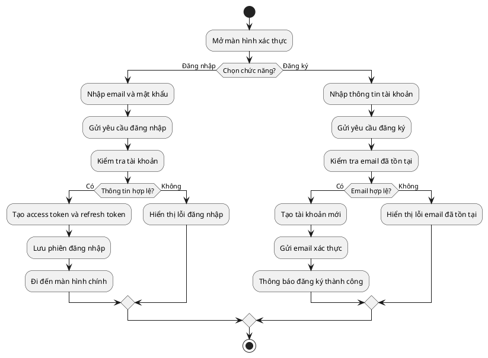
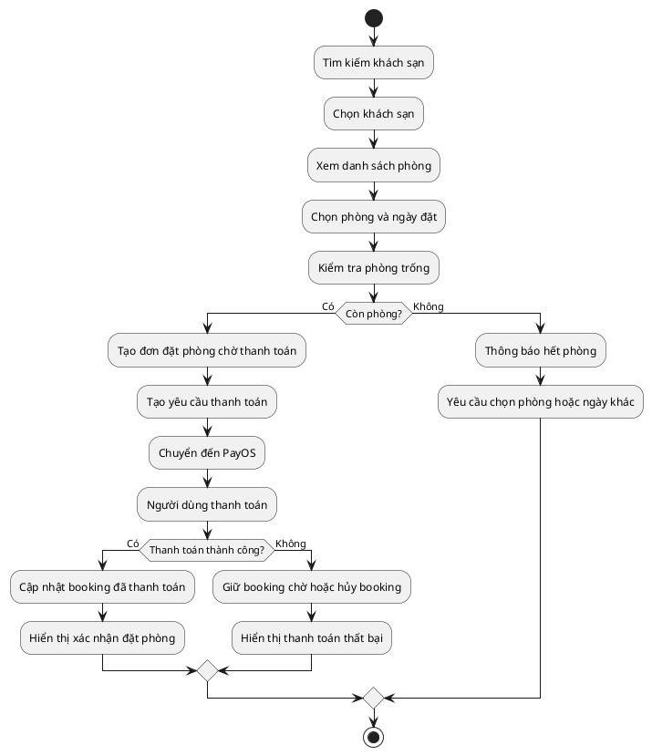
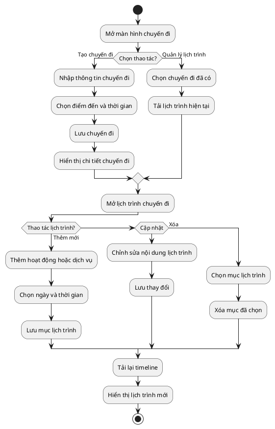
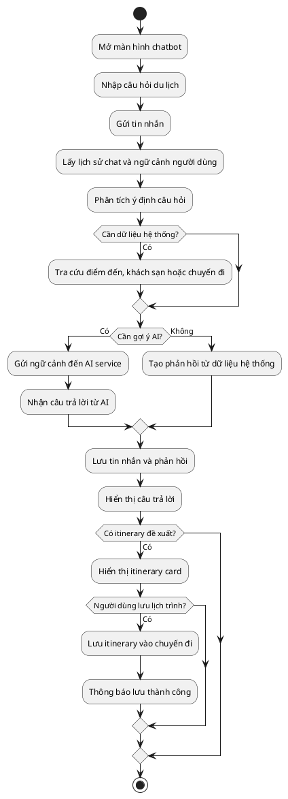
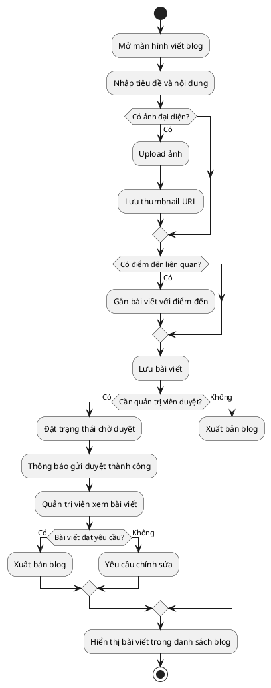

# Sơ đồ Activity - Skynet Smart Trip

Tài liệu này chứa mã PlantUML cho 5 sơ đồ activity của các module chính trong hệ thống.

## 1. Đăng nhập và đăng ký

## 2. Đặt phòng khách sạn

## 3. Tạo chuyến đi và quản lý lịch trình

## 4. AI chatbot

## 5. Viết blog

