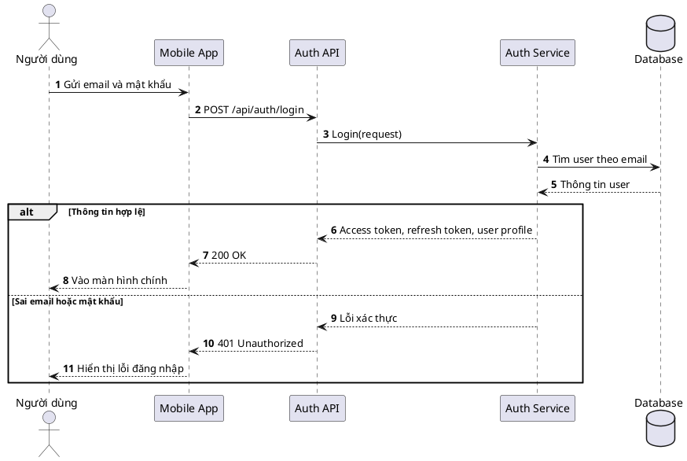
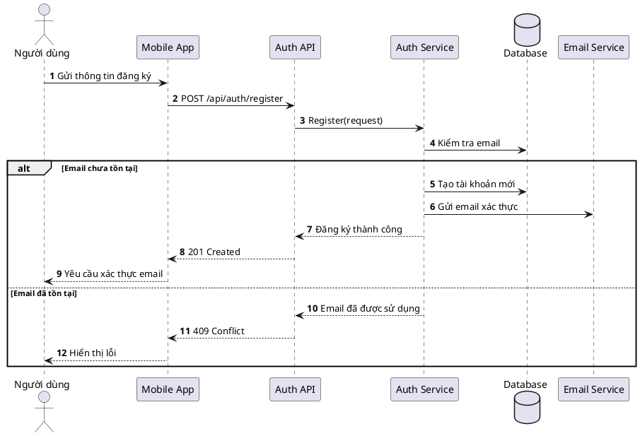
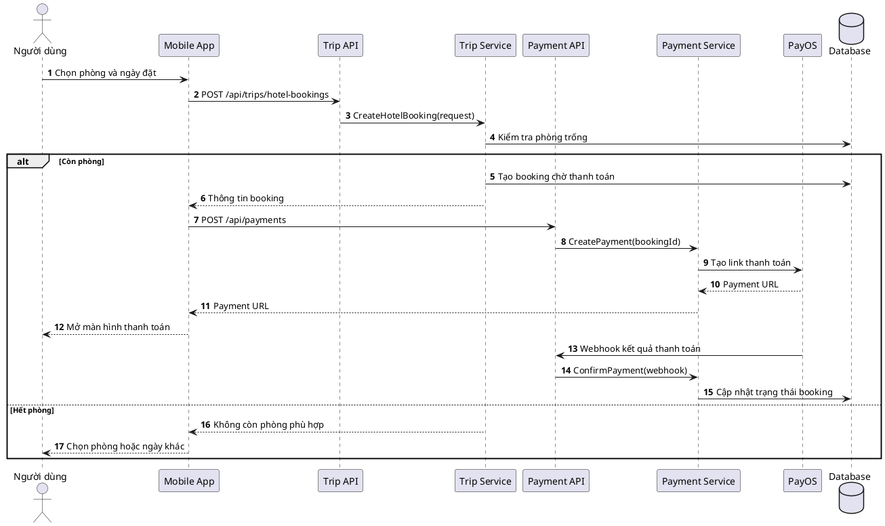
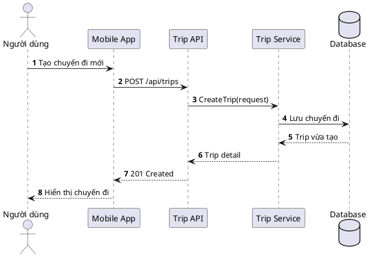
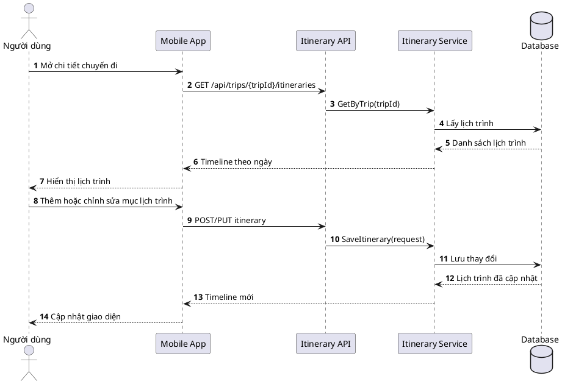
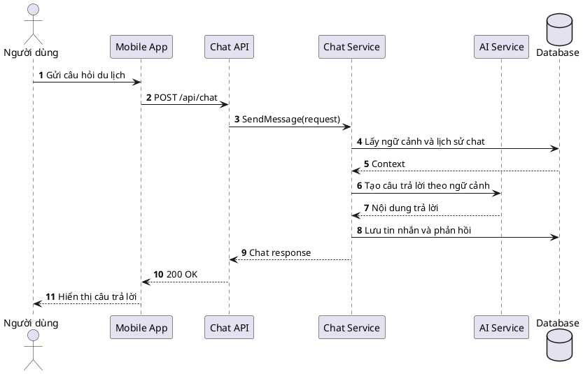
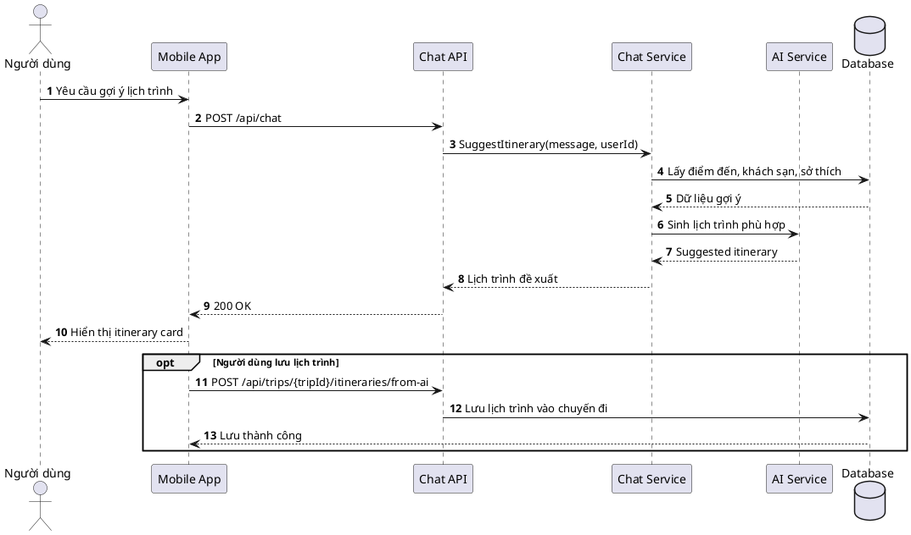
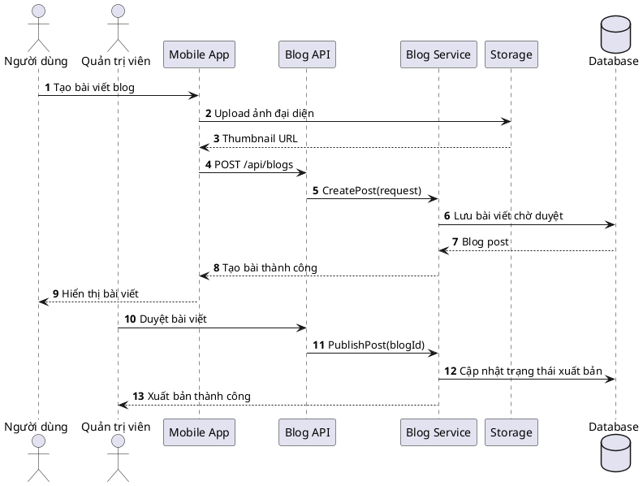
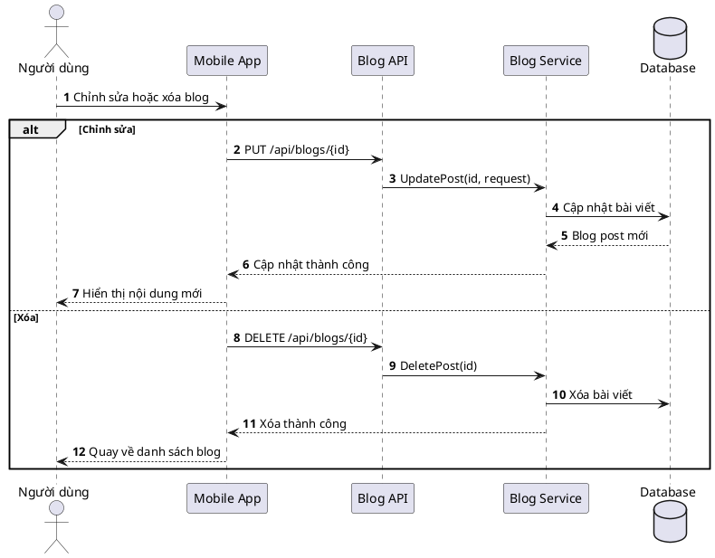

# Sơ đồ Sequence - Skynet Smart Trip

Tài liệu này chứa mã PlantUML cho các sơ đồ sequence của các module chính. Các sơ đồ được viết theo hướng ngắn gọn, dễ đọc, tập trung vào luồng nghiệp vụ chính và không dùng role "Khách".

## 1. Đăng nhập

## 2. Đăng ký

## 3. Đặt phòng khách sạn

## 4. Tạo chuyến đi

## 5. Quản lý lịch trình

## 6. AI chatbot

## 7. AI gợi ý lịch trình

## 8. Viết blog

## 9. Chỉnh sửa hoặc xóa blog

