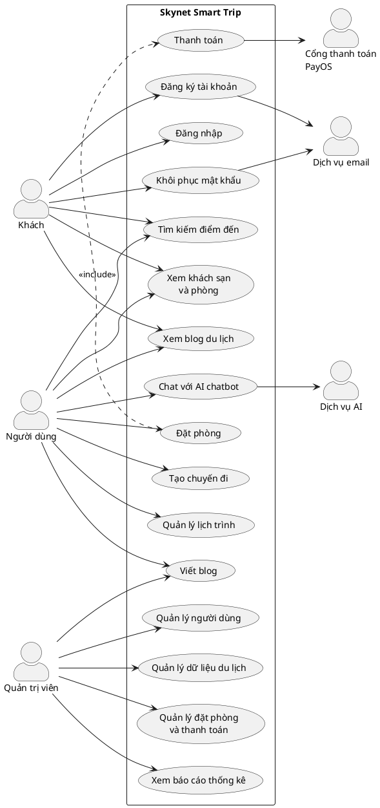
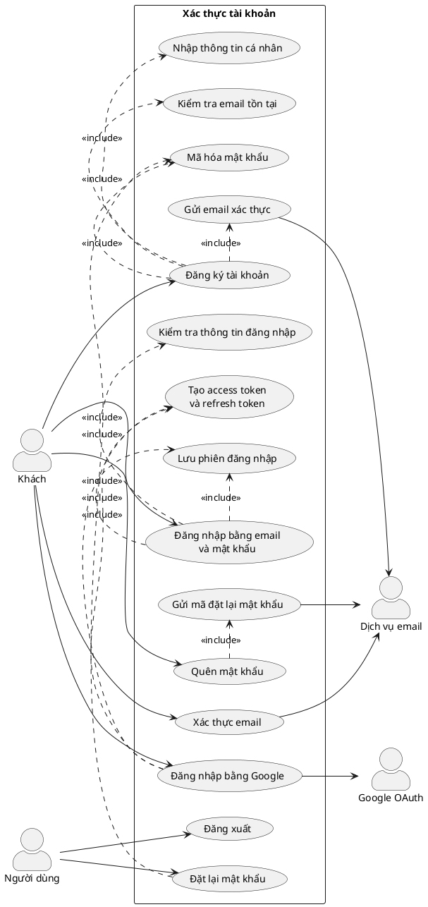
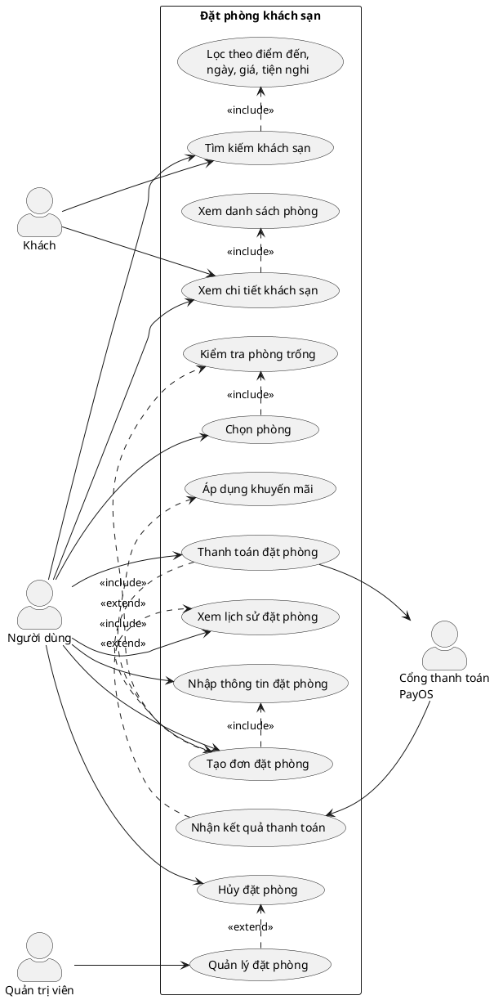
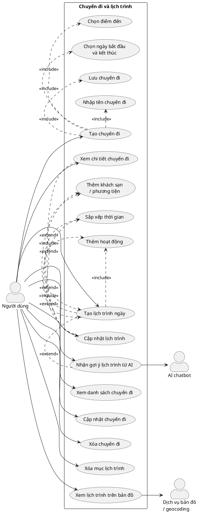
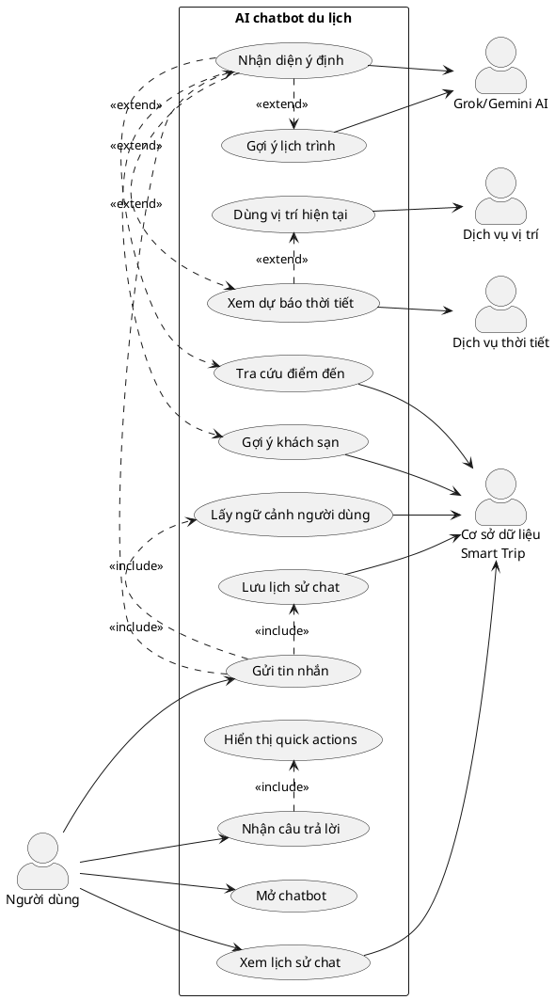
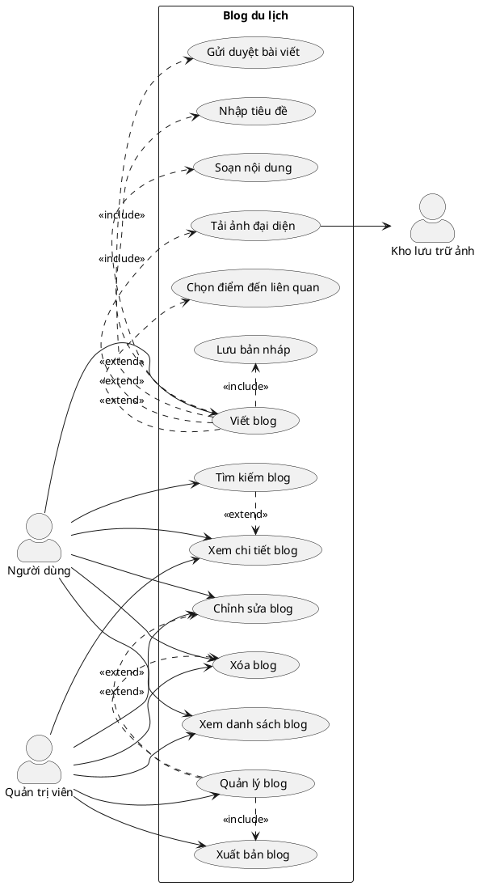

# Sơ đồ Use Case - Skynet Smart Trip

Tài liệu này chứa mã PlantUML cho các sơ đồ use case chính của hệ thống Skynet Smart Trip.

## 1. Sơ đồ use case tổng quát

## 2. Use case đăng nhập và đăng ký

## 3. Use case đặt phòng

## 4. Use case tạo chuyến đi và quản lý lịch trình

## 5. Use case AI chatbot

## 6. Use case viết blog

