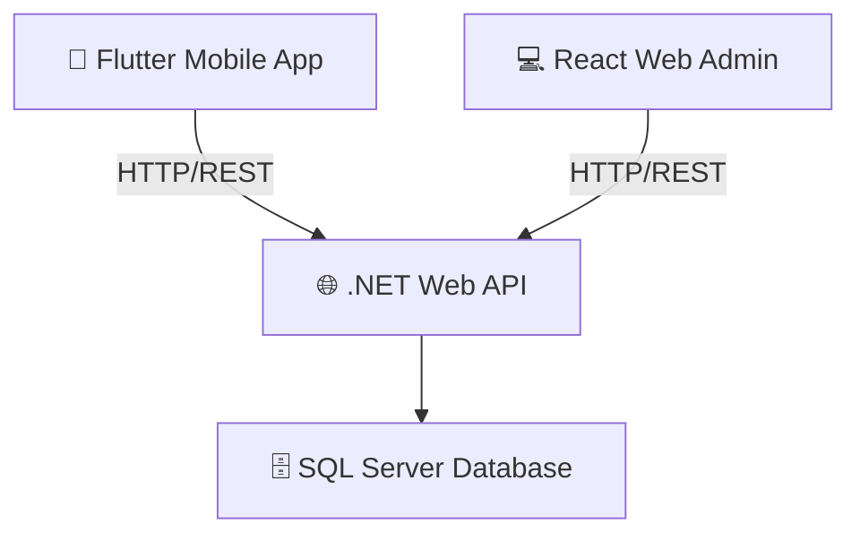

# 📱 Hướng Dẫn Phát Triển - Skynet Smart Trip

> Dự án du lịch thông minh gồm 3 thành phần chính: **Flutter Mobile App**, **.NET Backend API**, và **SQL Server Database**

---

## 🗺️ Tổng Quan Kiến Trúc



Dự án sử dụng kiến trúc **Clean Architecture** ở backend và **MVVM** ở mobile:

| Thành phần | Công nghệ | Vị trí |
|---|---|---|
| Mobile App | Flutter + Dart | `mobile/` |
| Backend API | .NET 8 + C# | `backend/` |
| Database | SQL Server | `database/` |
| Web Admin | React + Vite | `web/` |

---

## 📁 Cấu Trúc Thư Mục Chi Tiết

### 1. 📱 MOBILE (Flutter) — `mobile/lib/`

```
mobile/lib/
├── main.dart                    ← Điểm khởi động app
├── core/
│   └── core.dart                ← Export file (constants, theme, routes, utils)
├── models/
│   └── models.dart              ← Export file (data models)
├── services/
│   └── services.dart            ← Export file (API call services)
├── providers/
│   └── providers.dart           ← Export file (state management)
├── views/
│   └── views.dart               ← Export file (màn hình)
└── widgets/
    └── widgets.dart             ← Export file (widget dùng chung)
```

> [!NOTE]
> Các thư mục hiện chỉ có file `*.dart` export rỗng — bạn cần **tạo thêm các sub-file** bên trong mỗi thư mục.

---

### 2. 🏗️ BACKEND (.NET Clean Architecture) — `backend/`

```
backend/
├── SmartTrip.API/               ← Tầng trình bày (Controllers, API endpoints)
│   ├── Controllers/
│   │   └── AuthController.cs    ← Controller duy nhất hiện có
│   ├── Requests/
│   │   └── LoginRequest.cs      ← Request DTO
│   ├── Responses/               ← Response DTO
│   ├── Middlewares/             ← Middleware (xác thực, log lỗi...)
│   └── Program.cs               ← Entry point, DI config
│
├── SmartTrip.Application/       ← Tầng nghiệp vụ (Business Logic)
│   ├── Services/
│   │   └── AuthService.cs       ← Service duy nhất hiện có
│   ├── Interfaces/
│   │   └── User/                ← Interface cho Repository
│   └── DTOs/
│       └── Auth/                ← Data Transfer Objects
│
├── SmartTrip.Domain/            ← Tầng miền (Entities thuần túy)
│   ├── Entities/                ← 19 entity classes (User, Trip, Hotel...)
│   └── Enums/                   ← Các enum
│
└── SmartTrip.Infrastructure/    ← Tầng hạ tầng (DB, External Services)
    ├── Data/
    │   └── ApplicationDbContext.cs ← EF Core DbContext
    ├── Repositories/
    │   └── UserRepository.cs    ← Repository duy nhất hiện có
    ├── ExternalServices/        ← Dịch vụ bên ngoài (email, payment...)
    └── DependencyInjection.cs   ← Đăng ký DI
```

### 3. 🗄️ DATABASE — [database/database.sql](file:///d:/lap_trinh_di_dong/BaiGiuaKy/Skynet-Smart-Trip/database/database.sql)

Đã có schema đầy đủ với **19 bảng** thuộc 6 nhóm chức năng:

| Nhóm | Bảng |
|---|---|
| 👤 Người dùng | USERS, USER_WALLETS |
| 🏖️ Điểm đến | DESTINATIONS, GALLERIES, BLOG_POSTS |
| 🏨 Khách sạn | AMENITIES, HOTELS, HOTEL_AMENITY_MAPPING, ROOMS |
| 🚌 Xe khách | BUS_COMPANIES, BUS_SCHEDULES, SEATS |
| 📋 Lịch trình | PROMOTIONS, TRIPS, TRIP_ITINERARIES, PAYMENTS |
| ⭐ Hậu mãi | REVIEWS, INVOICES, WISHLISTS, NOTIFICATIONS |

---

## 🚀 Thứ Tự Ưu Tiên Code

> [!IMPORTANT]
> Nên code theo thứ tự: **Database → Backend → Mobile** để đảm bảo API sẵn sàng trước khi làm UI.

### Phase 1: Hoàn thiện Backend

#### Bước 1 — Domain Entities (đã có, kiểm tra lại)
**File:** `backend/SmartTrip.Domain/Entities/*.cs`

Đã có 19 entity. Kiểm tra và bổ sung nếu thiếu logic domain.

#### Bước 2 — Application Layer
**Thư mục:** `backend/SmartTrip.Application/`

Cần tạo cho **mỗi entity**:

```
SmartTrip.Application/
├── DTOs/
│   ├── Auth/LoginDto.cs
│   ├── Destination/DestinationDto.cs
│   ├── Hotel/HotelDto.cs, HotelDetailDto.cs
│   ├── Trip/TripDto.cs, CreateTripDto.cs
│   └── ...
├── Interfaces/
│   ├── IAuthService.cs
│   ├── IDestinationService.cs
│   ├── IHotelService.cs
│   ├── ITripService.cs
│   └── IUserRepository.cs
└── Services/
    ├── AuthService.cs            ← đã có skeleton
    ├── DestinationService.cs
    ├── HotelService.cs
    ├── TripService.cs
    └── ...
```

**Ví dụ** `IAuthService.cs`:
```csharp
public interface IAuthService
{
    Task<LoginResponseDto> LoginAsync(LoginDto dto);
    Task<UserDto> RegisterAsync(RegisterDto dto);
}
```

#### Bước 3 — Infrastructure Layer
**Thư mục:** `backend/SmartTrip.Infrastructure/`

```
Repositories/
├── UserRepository.cs           ← đã có skeleton
├── DestinationRepository.cs
├── HotelRepository.cs
├── TripRepository.cs
└── ...
```

**Việc cần làm:**
1. Cập nhật [ApplicationDbContext.cs](file:///d:/lap_trinh_di_dong/BaiGiuaKy/Skynet-Smart-Trip/backend/SmartTrip.Infrastructure/Data/ApplicationDbContext.cs) — thêm `DbSet<>` cho tất cả entity
2. Tạo Repository cho mỗi entity, implement interface tương ứng
3. Cập nhật [DependencyInjection.cs](file:///d:/lap_trinh_di_dong/BaiGiuaKy/Skynet-Smart-Trip/backend/SmartTrip.Infrastructure/DependencyInjection.cs) — đăng ký service & repository

**Ví dụ** [DependencyInjection.cs](file:///d:/lap_trinh_di_dong/BaiGiuaKy/Skynet-Smart-Trip/backend/SmartTrip.Infrastructure/DependencyInjection.cs):
```csharp
public static IServiceCollection AddInfrastructure(this IServiceCollection services, IConfiguration config)
{
    services.AddDbContext<ApplicationDbContext>(opt =>
        opt.UseSqlServer(config.GetConnectionString("SmartTrip")));
    services.AddScoped<IUserRepository, UserRepository>();
    services.AddScoped<IHotelRepository, HotelRepository>();
    // ...
    return services;
}
```

#### Bước 4 — API Controllers
**Thư mục:** `backend/SmartTrip.API/Controllers/`

Tạo controller cho từng nhóm chức năng:

```
Controllers/
├── AuthController.cs           ← đã có skeleton
├── UserController.cs
├── DestinationController.cs
├── HotelController.cs
├── RoomController.cs
├── BusController.cs
├── TripController.cs
├── PaymentController.cs
├── ReviewController.cs
└── NotificationController.cs
```

**Ví dụ** `DestinationController.cs`:
```csharp
[ApiController]
[Route("api/[controller]")]
public class DestinationController : ControllerBase
{
    private readonly IDestinationService _service;
    public DestinationController(IDestinationService service) => _service = service;

    [HttpGet]
    public async Task<IActionResult> GetAll() => Ok(await _service.GetAllAsync());

    [HttpGet("{id}")]
    public async Task<IActionResult> GetById(int id) => Ok(await _service.GetByIdAsync(id));
}
```

---

### Phase 2: Hoàn thiện Mobile Flutter

#### Bước 1 — Cập nhật [pubspec.yaml](file:///d:/lap_trinh_di_dong/BaiGiuaKy/Skynet-Smart-Trip/mobile/pubspec.yaml)

Thêm các dependency cần thiết vào [mobile/pubspec.yaml](file:///d:/lap_trinh_di_dong/BaiGiuaKy/Skynet-Smart-Trip/mobile/pubspec.yaml):

```yaml
dependencies:
  flutter:
    sdk: flutter
  cupertino_icons: ^1.0.8
  
  # State Management
  provider: ^6.1.2          # hoặc flutter_riverpod / bloc
  
  # HTTP & API
  http: ^1.2.1
  dio: ^5.4.3
  
  # Storage
  shared_preferences: ^2.2.3
  flutter_secure_storage: ^9.2.2
  
  # Navigation
  go_router: ^13.2.4
  
  # UI
  cached_network_image: ^3.3.1
  flutter_svg: ^2.0.10
  
  # Utils
  intl: ^0.19.0
```

#### Bước 2 — Core Layer
**Thư mục:** `mobile/lib/core/`

Tạo các file cốt lõi (bên cạnh [core.dart](file:///d:/lap_trinh_di_dong/BaiGiuaKy/Skynet-Smart-Trip/mobile/lib/core/core.dart)):

```
core/
├── core.dart                   ← export tất cả file bên dưới
├── app_constants.dart          ← BASE_URL, appName, timeouts
├── app_theme.dart              ← ThemeData, colors, fonts
├── app_routes.dart             ← GoRouter config
└── app_exceptions.dart         ← Custom exceptions
```

**Ví dụ** `app_constants.dart`:
```dart
class AppConstants {
  static const String baseUrl = 'http://10.0.2.2:5000/api'; // Android emulator
  // static const String baseUrl = 'http://localhost:5000/api'; // iOS simulator
  static const String appName = 'Skynet Smart Trip';
}
```

**Ví dụ** `app_theme.dart`:
```dart
class AppTheme {
  static ThemeData get light => ThemeData(
    colorScheme: ColorScheme.fromSeed(seedColor: const Color(0xFF1E88E5)),
    useMaterial3: true,
    fontFamily: 'Inter',
  );
}
```

#### Bước 3 — Models
**Thư mục:** `mobile/lib/models/`

Tạo model Dart tương ứng với mỗi entity:

```
models/
├── models.dart                 ← export tất cả
├── user_model.dart
├── destination_model.dart
├── hotel_model.dart
├── room_model.dart
├── trip_model.dart
├── bus_schedule_model.dart
└── review_model.dart
```

**Ví dụ** `destination_model.dart`:
```dart
class DestinationModel {
  final int destId;
  final String name;
  final String? description;
  final String? coverImageUrl;
  final bool isHot;

  DestinationModel({
    required this.destId,
    required this.name,
    this.description,
    this.coverImageUrl,
    this.isHot = false,
  });

  factory DestinationModel.fromJson(Map<String, dynamic> json) => DestinationModel(
    destId: json['destId'],
    name: json['name'],
    description: json['description'],
    coverImageUrl: json['coverImageUrl'],
    isHot: json['isHot'] ?? false,
  );
}
```

#### Bước 4 — Services (Gọi API)
**Thư mục:** `mobile/lib/services/`

Tạo một `ApiService` base và các service con:

```
services/
├── services.dart               ← export tất cả
├── api_service.dart            ← Base HTTP client (Dio setup)
├── auth_service.dart           ← login, register, logout
├── destination_service.dart    ← getAll, getById
├── hotel_service.dart          ← search, detail
├── trip_service.dart           ← create, update, list
└── payment_service.dart        ← pay, history
```

**Ví dụ** `api_service.dart`:
```dart
class ApiService {
  static final Dio _dio = Dio(BaseOptions(
    baseUrl: AppConstants.baseUrl,
    connectTimeout: const Duration(seconds: 10),
    receiveTimeout: const Duration(seconds: 10),
  ));

  static Future<Response> get(String path) => _dio.get(path);
  static Future<Response> post(String path, dynamic data) => _dio.post(path, data: data);
  static Future<Response> put(String path, dynamic data) => _dio.put(path, data: data);
  static Future<Response> delete(String path) => _dio.delete(path);
}
```

**Ví dụ** `destination_service.dart`:
```dart
class DestinationService {
  static Future<List<DestinationModel>> getAll() async {
    final res = await ApiService.get('/destination');
    return (res.data as List).map((e) => DestinationModel.fromJson(e)).toList();
  }
}
```

#### Bước 5 — Providers (State Management)
**Thư mục:** `mobile/lib/providers/`

```
providers/
├── providers.dart              ← export tất cả
├── auth_provider.dart          ← trạng thái đăng nhập
├── destination_provider.dart   ← danh sách điểm đến
├── hotel_provider.dart         ← khách sạn
└── trip_provider.dart          ← lịch trình hiện tại
```

**Ví dụ** `auth_provider.dart`:
```dart
class AuthProvider extends ChangeNotifier {
  UserModel? _currentUser;
  bool _isLoading = false;

  UserModel? get currentUser => _currentUser;
  bool get isLoading => _isLoading;
  bool get isLoggedIn => _currentUser != null;

  Future<void> login(String email, String password) async {
    _isLoading = true;
    notifyListeners();
    try {
      _currentUser = await AuthService.login(email, password);
    } finally {
      _isLoading = false;
      notifyListeners();
    }
  }
}
```

#### Bước 6 — Views (Màn Hình)
**Thư mục:** `mobile/lib/views/`

Tổ chức theo chức năng:

```
views/
├── views.dart
├── auth/
│   ├── login_screen.dart
│   └── register_screen.dart
├── home/
│   └── home_screen.dart
├── destination/
│   ├── destination_list_screen.dart
│   └── destination_detail_screen.dart
├── hotel/
│   ├── hotel_list_screen.dart
│   ├── hotel_detail_screen.dart
│   └── room_booking_screen.dart
├── bus/
│   ├── bus_search_screen.dart
│   └── seat_select_screen.dart
├── trip/
│   ├── trip_list_screen.dart
│   ├── trip_detail_screen.dart
│   └── create_trip_screen.dart
├── payment/
│   └── payment_screen.dart
├── profile/
│   └── profile_screen.dart
└── notification/
    └── notification_screen.dart
```

#### Bước 7 — Widgets Dùng Chung
**Thư mục:** `mobile/lib/widgets/`

```
widgets/
├── widgets.dart
├── common/
│   ├── app_button.dart         ← Custom button
│   ├── app_text_field.dart     ← Custom input
│   ├── loading_widget.dart     ← Loading indicator
│   └── error_widget.dart       ← Error display
├── cards/
│   ├── destination_card.dart
│   ├── hotel_card.dart
│   └── trip_card.dart
└── navigation/
    └── bottom_nav_bar.dart
```

#### Bước 8 — Cập nhật [main.dart](file:///d:/lap_trinh_di_dong/BaiGiuaKy/Skynet-Smart-Trip/mobile/lib/main.dart)

```dart
import 'package:flutter/material.dart';
import 'package:provider/provider.dart';
import 'core/core.dart';
import 'providers/providers.dart';

void main() {
  runApp(const MyApp());
}

class MyApp extends StatelessWidget {
  const MyApp({super.key});

  @override
  Widget build(BuildContext context) {
    return MultiProvider(
      providers: [
        ChangeNotifierProvider(create: (_) => AuthProvider()),
        ChangeNotifierProvider(create: (_) => DestinationProvider()),
        ChangeNotifierProvider(create: (_) => HotelProvider()),
        ChangeNotifierProvider(create: (_) => TripProvider()),
      ],
      child: MaterialApp.router(
        title: AppConstants.appName,
        theme: AppTheme.light,
        routerConfig: AppRoutes.router,
      ),
    );
  }
}
```

---

## 🗺️ Sơ Đồ Luồng Dữ Liệu

```
[Flutter Screen]
      ↓ gọi
[Provider] — quản lý state (loading, data, error)
      ↓ gọi
[Service] — gọi HTTP API
      ↓ HTTP
[.NET API Controller]
      ↓ inject
[Application Service] — business logic
      ↓ inject
[Repository] — truy vấn EF Core
      ↓ EF Core
[SQL Server Database]
```

---

## 📋 Checklist Flow Phát Triển

### ✅ Backend
- [ ] Bổ sung `DbSet<>` trong [ApplicationDbContext.cs](file:///d:/lap_trinh_di_dong/BaiGiuaKy/Skynet-Smart-Trip/backend/SmartTrip.Infrastructure/Data/ApplicationDbContext.cs) cho đủ 19 bảng
- [ ] Cập nhật [appsettings.json](file:///d:/lap_trinh_di_dong/BaiGiuaKy/Skynet-Smart-Trip/backend/SmartTrip.API/appsettings.json) với connection string thật
- [ ] Bỏ comment dòng `AddDbContext` trong [Program.cs](file:///d:/lap_trinh_di_dong/BaiGiuaKy/Skynet-Smart-Trip/backend/SmartTrip.API/Program.cs)
- [ ] Gọi `builder.Services.AddInfrastructure(...)` trong [Program.cs](file:///d:/lap_trinh_di_dong/BaiGiuaKy/Skynet-Smart-Trip/backend/SmartTrip.API/Program.cs)
- [ ] Tạo Interface cho mỗi Service & Repository
- [ ] Implement Service (AuthService, DestinationService, HotelService, TripService...)
- [ ] Implement Repository (CRUD cho mỗi entity)
- [ ] Tạo Controller endpoints (CRUD + search)
- [ ] Thêm JWT Authentication middleware
- [ ] Test API qua Swagger UI

### ✅ Mobile
- [ ] Cập nhật [pubspec.yaml](file:///d:/lap_trinh_di_dong/BaiGiuaKy/Skynet-Smart-Trip/mobile/pubspec.yaml) với dependencies
- [ ] Chạy `flutter pub get`
- [ ] Tạo `core/` với constants, theme, routes
- [ ] Tạo Models Dart cho từng entity
- [ ] Tạo Services gọi API
- [ ] Tạo Providers quản lý state
- [ ] Tạo màn hình (Views) cho mỗi chức năng
- [ ] Tạo Widgets dùng chung
- [ ] Cập nhật [main.dart](file:///d:/lap_trinh_di_dong/BaiGiuaKy/Skynet-Smart-Trip/mobile/lib/main.dart)
- [ ] Test kết nối API từ emulator

---

## 🔧 Cấu Hình Kết Nối

### Backend — [appsettings.json](file:///d:/lap_trinh_di_dong/BaiGiuaKy/Skynet-Smart-Trip/backend/SmartTrip.API/appsettings.json)
```json
{
  "ConnectionStrings": {
    "SmartTrip": "Server=localhost;Database=SkynetSmartTrip;Trusted_Connection=True;TrustServerCertificate=True"
  },
  "JwtSettings": {
    "SecretKey": "your-super-secret-key-min-32-chars",
    "Issuer": "SmartTripAPI",
    "Audience": "SmartTripMobile",
    "ExpiryMinutes": 60
  }
}
```

### Mobile — BASE_URL
| Môi trường | URL |
|---|---|
| Android Emulator | `http://10.0.2.2:5000/api` |
| iOS Simulator | `http://localhost:5000/api` |
| Thiết bị thật | `http://<IP_máy_tính>:5000/api` |

---

## 💡 Tips

> [!TIP]
> **Chạy backend trước:** Mở solution [Skynet-Smart-Trip.sln](file:///d:/lap_trinh_di_dong/BaiGiuaKy/Skynet-Smart-Trip/Skynet-Smart-Trip.sln) bằng Visual Studio → chạy project `SmartTrip.API` → truy cập `https://localhost:7xxx/swagger` để test API.

> [!TIP]
> **Chạy mobile:** Mở thư mục `mobile/` bằng VS Code → mở terminal → chạy `flutter run`.

> [!WARNING]
> Nhớ bật CORS trong [Program.cs](file:///d:/lap_trinh_di_dong/BaiGiuaKy/Skynet-Smart-Trip/backend/SmartTrip.API/Program.cs) backend để cho phép mobile kết nối:
> ```csharp
> builder.Services.AddCors(opt => opt.AddDefaultPolicy(p =>
>     p.AllowAnyOrigin().AllowAnyHeader().AllowAnyMethod()));
> // và sau Build():
> app.UseCors();
> ```

> [!CAUTION]
> Không hardcode JWT secret key hay connection string trong code. Dùng [appsettings.json](file:///d:/lap_trinh_di_dong/BaiGiuaKy/Skynet-Smart-Trip/backend/SmartTrip.API/appsettings.json) hoặc biến môi trường (Environment Variables) khi deploy.
